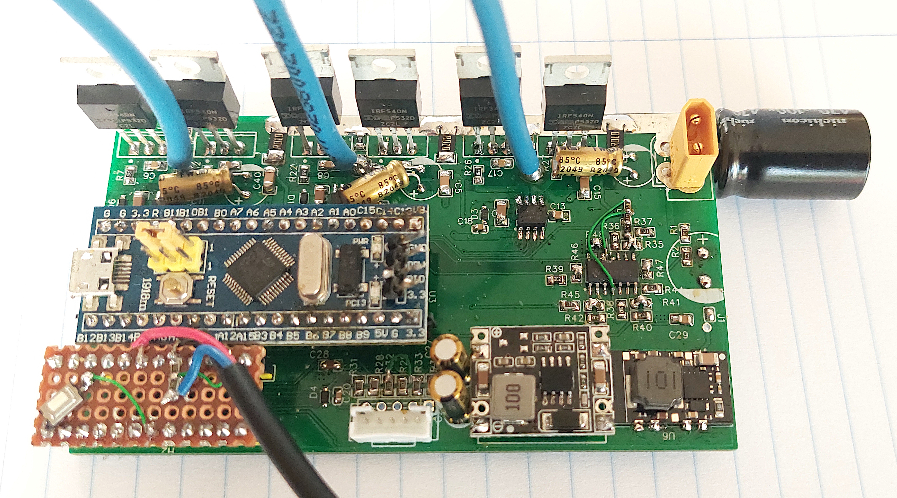
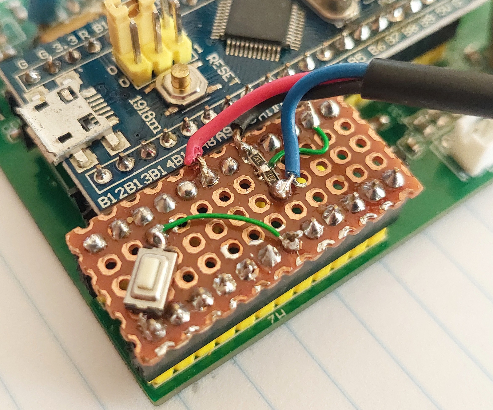

# EasiDIY ESC
The target for this EV motor controller is to power small EVs like EBikes or EScooters like Xiaomi M365.

## Main objectives:
* **Possible to add custom electronics:** for reusing this motor controller on different devices, customize it for the specifics of each project.
* **Easy to build and repair:** build at home DIY. Use popular components. Repair if needed or unsolder the components to reuse on another projects.

## Characteristics:
* **Header for custom electronics board:** other board can be connected, like a perforated board with some simple electronics for instance to add CAN communications, 2x UARTS: full duplex or half duplex; specific circuit for EBikes torque sensors; SPI or I2C for cheap popular OLED displays; add a Bluetooth module; add NRF52 board with EBike ANT+ LEV wireless standard, etc.

* **Easy to build and repair as DIY:** no fine pitch components as like a STM32 microcontroller - uses DC-DC modules as also the Bluepill STM32 board. The resistors and capacitors are 0805. The ICs are SOIC8 and SOIC14. This means it can be easily soldered at home.

* **Popular components:** Uses the popular Bluepill STM32F103 board, meaning it is easy to develop firmware for it. Uses popular components common found on EBikes chinese motor controllers.

## Current state

### v0.5 - 19.03.2022
* The board was completely redesigned, including significant schematic and part changes. The new board is significantly smaller and hopefully significantly better. 
* Not tested yet

### v0.1 - 30.01.2022,
* First board prototype had two minor issues that were easy solved. See here a Xiaomi M365 motor running: https://www.youtube.com/watch?v=NelnB91Vqgw 
The plan is to design a new version of the board with corrections and improvements on the power that the board can handle, as also make it smaller as possible while maintaining the 0805 components for easy DIY building at home.

Some pictures of v0.1:

And here is my custom electronics board, quickly made with a perforated board. Added a button to execute the motor autodetection and two 0805 resistors to adapt the throttle 5V signal to the 3.3V scale: 
