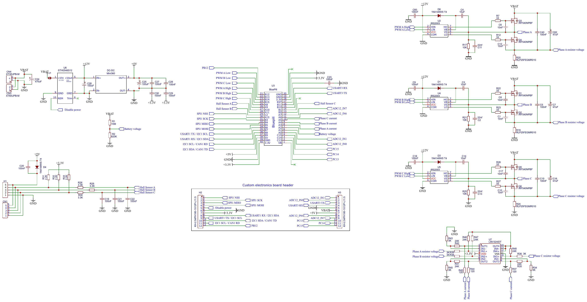

# EV Motor Controller Customizable Electronics
The target for this EV motor controller is to power small EVs like EBikes or EScooters like Xiaomi M365.

Main objectives:
* **Possible to add custom electronics:** for reusing this motor controller on different devices, customize it for the specifics of each project.
* **Easy to build and repair:** build at home DIY. Use popular components. Repair if needed or unsolder the components to reuse on another projects.

Characteristics:
* **Header for custom electronics board:** other board can be connected, like a perforated board with some simple electronics for instance to add CAN communications, 2x UARTS: full duplex or half duplex; specific circuit for EBikes torque sensors; SPI or I2C for cheap popular OLED displays; add a Bluetooth module; add NRF52 board with EBike ANT+ LEV wireless standard, etc.

* **Easy to build and repair as DIY:** no fine pitch components as like a STM32 microcontroller - uses DC-DC modules as also the Bluepill STM32 board. The resistors and capacitors are 0805. The ICs are SOIC8 and SOIC14. This means it can be easily soldered at home.

* **Popular components:** Uses the popular Bluepill STM32F103 board, meaning it is easy to develop firmware for it. Uses popular components common found on EBikes chinese motor controllers.

**Current state**

As of 31.12.2021,
* the schematic was discussed between Andrii and Casainho. Andrii already did a similar motor controller and is confident on this schematic.
* the PCB was designed by Andrii
* the PCB was ordered and next steps are to build and test the motor controller, using this OpenSource firmware: https://github.com/Koxx3/SmartESC_STM32_v3

Schematic:

PCB:

